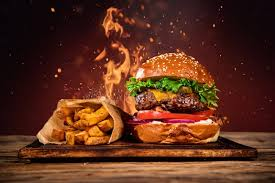

# Ex.07 Restaurant Website
# Date: 17.12.2025
# AIM:
To develop a static Restaurant website to display the food items and services provided by them.

# DESIGN STEPS:
## Step 1:
Requirement collection.

## Step 2:
Creating the layout using HTML and CSS.

## Step 3:
Updating the sample content.

## Step 4:
Choose the appropriate style and color scheme.

## Step 5:
Validate the layout in various browsers.

## Step 6:
Validate the HTML code.

## Step 7:
Publish the website in the given URL.

# PROGRAM:
```
index.html
<head>
  <meta charset="UTF-8" />
  <title>Restaurant</title>
  <link rel="stylesheet" href="style.css" />
</head>
<body class="home" >
  <nav>
    <ul>
      <li><a href="index.html">Home</a></li>
      <li><a href="menu.html">Menu</a></li>
      <li><a href="admin.html">Team</a></li>
      
      <li><a href="contact.html">Contact</a></li>
    </ul>
  </nav>
  <header class="hero">
    <h1>Welcome to Restaurant</h1>
    <p><b>Delicious moments delivered fresh to your plate</b></p>
  </header>
</body>

admin.html
<head>
  <meta charset="UTF-8" />
  <title>Our Team</title>
  <link rel="stylesheet" href="style.css" />
</head>
<body class="admin-page">
  <nav>
    <ul>
      <li><a href="index.html">Home</a></li>
      <li><a href="menu.html">Menu</a></li>
      <li><a href="admin.html">Team</a></li>
      <li><a href="contact.html">Contact</a></li>
    </ul>
  </nav>
  <section class="team-section">
  <h2 style="text-align: center; color: white;">Meet Our Team</h2>
  <div class="team-grid">
    <div class="team-member">
      
      <h3>mukeshkumar - Restaurant Manager</h3>
    </div>
    <div class="team-member">
      
      <h3>vijay - Head Chef</h3>
    </div>
    <div class="team-member">
      
      <h3>virat - Sous Chef</h3>
    </div>
    
    <div class="team-member">
      
      <h3>trisha - Lead Server</h3>
    </div>
    <div class="team-member">
      
      <h3>ravi - Barista</h3>
    </div>
    <div class="team-member">
      
      <h3>siva - Receptionist</h3>
    </div>
  </div>
</section>

</body>

menu.html
<head>
  <meta charset="UTF-8" />
  <title>Menu - Restaurant</title>
  <link rel="stylesheet" href="style.css" />
</head>
<body class="menu-page">
  <nav>
    <ul>
      <li><a href="index.html">Home</a></li>
      <li><a href="menu.html">Menu</a></li>
      <li><a href="admin.html">Team</a></li>
      
      <li><a href="contact.html">Contact</a></li>
    </ul>
  </nav>
  <h1 class="page-title">Our Specialties</h1>
  <div class="menu-grid">
    <div class="menu-item"><p>Cheesy Pepperoni Pizza</p></div>
    <div class="menu-item"><p>Classic Beef Burger</p></div>
    <div class="menu-item"><p>Italian Pasta Alfredo</p></div>
    <div class="menu-item"><p>Fresh Sushi Platter</p></div>
    <div class="menu-item"><p>Green Garden Salad</p></div>
    
    <div class="menu-item"><p>Tomato Basil Soup</p></div>
    <div class="menu-item"><p>Spicy Chicken Tacos</p></div>
    <div class="menu-item"><p>Chocolate Lava Cake</p></div>
    <div class="menu-item"><p>Vanilla Ice Cream</p></div>
    
    <div class="menu-item"><p>Spicy Asian Noodles</p></div>
  </div>
</body>
contact.html
<!DOCTYPE html>
<html lang="en">
<head>
  <meta charset="UTF-8" />
  <meta name="viewport" content="width=device-width, initial-scale=1.0" />
  <title>Contact Us</title>
  <link rel="stylesheet" href="style.css" />
  <link rel="stylesheet" href="https://cdnjs.cloudflare.com/ajax/libs/font-awesome/6.4.0/css/all.min.css" />
</head>
<body class="contact-page">
  <nav>
    <ul>
      <li><a href="index.html">Home</a></li>
      <li><a href="menu.html">Menu</a></li>
      <li><a href="admin.html">Team</a></li>
      
      <li><a href="contact.html">Contact</a></li>
    </ul>
  </nav>

  <div class="contact-container">
    <div class="contact-info">
      <h1>Get in Touch</h1>
      <p><i class="fas fa-map-marker-alt"></i> 123 Flavor Street, Food City, FC 45678</p>
      <p><i class="fas fa-phone-alt"></i> +1 (234) 567-8901</p>
      <p><i class="fas fa-envelope"></i> info@restaurant.com</p>
    </div>

    <div class="contact-form">
      <h2>Send Us a Message</h2>
      <form>
        <input type="text" placeholder="Your Name" required />
        <input type="email" placeholder="Your Email" required />
        <textarea rows="5" placeholder="Your Message"></textarea>
        <button type="submit">Send Message</button>
      </form>
    </div>
  </div>
</body>
</html>
```
# OUTPUT:


# RESULT:
The program for designing software company website using HTML and CSS is completed successfully.
